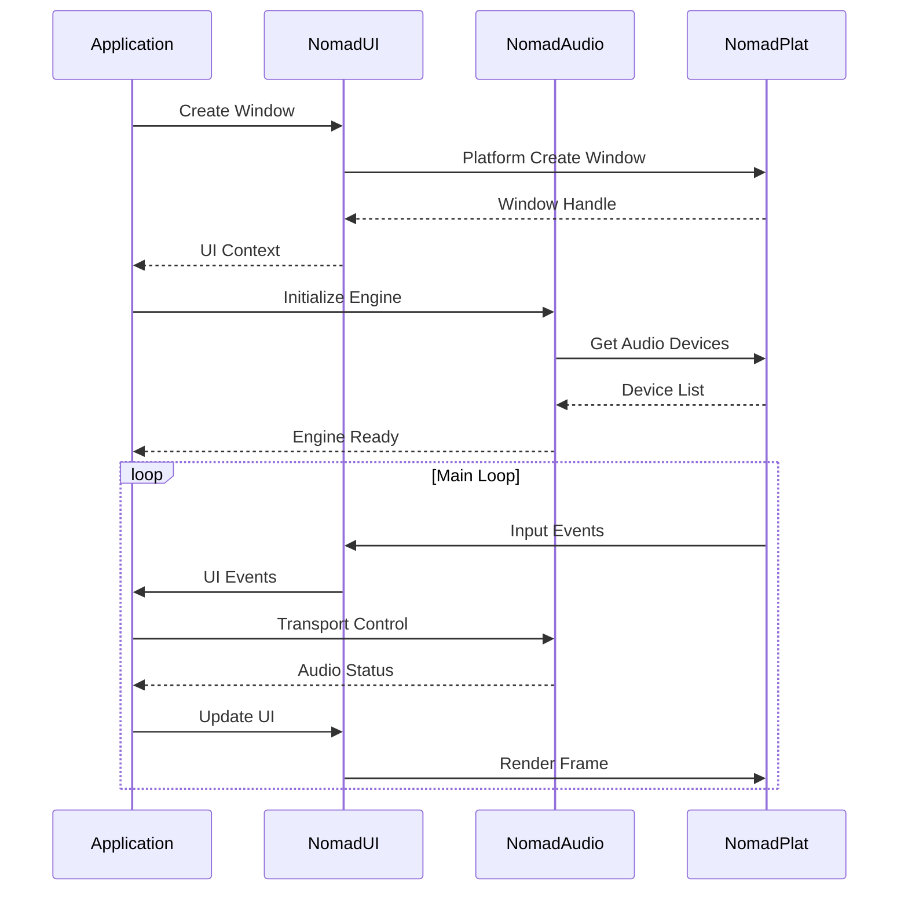

# Module Hierarchy

This page details the complete module hierarchy and dependencies in NOMAD DAW.

## 🏗️ Dependency Graph

```mermaid
graph TB
    subgraph Application
        DAW[NOMAD DAW]
    end
    
    subgraph Framework
        UI[NomadUI]
        Audio[NomadAudio]
        SDK[NomadSDK]
    end
    
    subgraph Platform
        Plat[NomadPlat]
    end
    
    subgraph Core
        Core[NomadCore]
    end
    
    DAW --> UI
    DAW --> Audio
    DAW --> SDK
    
    UI --> Plat
    Audio --> Plat
    SDK --> Plat
    
    Plat --> Core
    
    style DAW fill:#5c6bc0,color:#fff
    style UI fill:#00d9ff,color:#000
    style Audio fill:#00d9ff,color:#000
    style SDK fill:#00d9ff,color:#000
    style Plat fill:#7e57c2,color:#fff
    style Core fill:#9575cd,color:#fff
```

## 📦 Module Details

### Layer 0: NomadCore (Foundation)

**Purpose:** Provides fundamental utilities and data structures used throughout NOMAD.

**Status:** ✅ Complete

**Dependencies:** None (zero external dependencies)

**Key Components:**
- Math library (vectors, matrices, interpolation)
- Threading primitives (lock-free queues, thread pools)
- File I/O system (cross-platform file operations)
- Logging system (structured logging)
- Memory management (custom allocators)
- String utilities (UTF-8, formatting)

**Public API:**
```cpp
#include "NomadCore/Math/Vector.h"
#include "NomadCore/Threading/ThreadPool.h"
#include "NomadCore/IO/File.h"
#include "NomadCore/Logging/Logger.h"
```

[View NomadCore Details →](nomad-core.md)

---

### Layer 1: NomadPlat (Platform Abstraction)

**Purpose:** Provides unified API for platform-specific operations.

**Status:** ✅ Complete (Windows), 🚧 In Progress (Linux), 📅 Planned (macOS)

**Dependencies:** NomadCore

**Key Components:**
- Window management (create, resize, event handling)
- Input system (keyboard, mouse, touch)
- File dialogs (open/save)
- System information (CPU, memory, OS)
- High-resolution timers

**Supported Platforms:**
| Platform | Status | Implementation |
|----------|--------|----------------|
| Windows 10/11 | ✅ Complete | Win32 API |
| Linux | 🚧 In Progress | X11, Wayland planned |
| macOS | 📅 Planned Q2 2025 | Cocoa |

**Public API:**
```cpp
#include "NomadPlat/Window.h"
#include "NomadPlat/Input.h"
#include "NomadPlat/FileDialog.h"
```

[View NomadPlat Details →](nomad-plat.md)

---

### Layer 2: Framework Modules

#### NomadUI (GPU-Accelerated Renderer)

**Purpose:** Custom OpenGL-based UI framework with modern features.

**Status:** ✅ Complete

**Dependencies:** NomadCore, NomadPlat

**Key Components:**
- OpenGL 3.3+ renderer
- NanoVG vector graphics
- Layout engine (flexbox-inspired)
- Widget library (buttons, sliders, inputs)
- Theme system (dark/light modes)
- SVG icon system
- Animation system

**Performance:**
- Adaptive FPS: 24-60 FPS
- MSAA anti-aliasing
- Texture atlasing
- Dirty rectangle optimization

**Public API:**
```cpp
#include "NomadUI/Renderer.h"
#include "NomadUI/Widget.h"
#include "NomadUI/Layout.h"
#include "NomadUI/Theme.h"
```

[View NomadUI Details →](nomad-ui.md)

---

#### NomadAudio (Audio Engine)

**Purpose:** Professional audio processing with ultra-low latency.

**Status:** ✅ Complete

**Dependencies:** NomadCore, NomadPlat

**Key Components:**
- WASAPI integration (Windows)
- RtAudio backend (cross-platform)
- 64-bit audio pipeline
- Multi-threaded DSP
- Sample-accurate timing
- Low-latency design (<10ms)

**Audio Capabilities:**
- Sample rates: 44.1kHz - 192kHz
- Buffer sizes: 64 - 4096 samples
- Bit depths: 16, 24, 32-bit integer and float
- Channels: Up to 32

**Public API:**
```cpp
#include "NomadAudio/AudioEngine.h"
#include "NomadAudio/AudioDevice.h"
#include "NomadAudio/AudioBuffer.h"
```

[View NomadAudio Details →](nomad-audio.md)

---

#### NomadSDK (Plugin System)

**Purpose:** Plugin hosting and extension system.

**Status:** 📅 Planned Q2 2025

**Dependencies:** NomadCore, NomadPlat

**Planned Features:**
- VST3 plugin hosting
- Effect processing (inserts, sends)
- Parameter automation
- MIDI routing
- Plugin scanning and caching

**Planned API:**
```cpp
#include "NomadSDK/PluginHost.h"
#include "NomadSDK/Effect.h"
#include "NomadSDK/Automation.h"
```

---

### Layer 3: NOMAD DAW (Application)

**Purpose:** Main digital audio workstation application.

**Status:** 🚧 Active Development

**Dependencies:** All framework modules (NomadUI, NomadAudio, NomadSDK)

**Key Components:**
- Timeline/Sequencer (FL Studio-inspired)
- Mixer console
- Pattern editor
- Project management
- User preferences
- Plugin management

**Current Features:**
| Feature | Status |
|---------|--------|
| Timeline | ✅ Complete |
| Audio Playback | ✅ Complete |
| Theme System | ✅ Complete |
| Sample Manipulation | 🚧 In Progress |
| Mixing Controls | 🚧 In Progress |
| VST3 Hosting | 📅 Q2 2025 |
| MIDI Support | 📅 Q2 2025 |

---

## 🔗 Module Communication

### Inter-Module Communication Patterns



### Data Flow Patterns

#### 1. Event-Driven (UI → Application)

```cpp
// UI generates events
ui.onButtonClick([&](Button* btn) {
    app.handlePlayButton();
});
```

#### 2. Callback-Based (Audio → Application)

```cpp
// Audio engine calls back on audio thread
audio.setCallback([&](AudioBuffer& buffer) {
    app.processAudioBlock(buffer);
});
```

#### 3. Polling (Application → Platform)

```cpp
// Application polls platform state
while (app.running) {
    plat.pollEvents();
    app.update();
}
```

## 📊 Module Statistics

### Code Metrics

| Module | Lines of Code | Header Files | Source Files | Dependencies |
|--------|--------------|--------------|--------------|--------------|
| NomadCore | ~5,000 | 25 | 20 | 0 |
| NomadPlat | ~8,000 | 15 | 35 | 1 (Core) |
| NomadUI | ~12,000 | 45 | 60 | 2 (Core, Plat) |
| NomadAudio | ~10,000 | 30 | 50 | 2 (Core, Plat) |
| NomadSDK | ~0 (planned) | - | - | 2 (Core, Plat) |
| Application | ~15,000 | 60 | 80 | 4 (All) |
| **Total** | **~50,000** | **175** | **245** | - |

### Build Times (Release, 8-core CPU)

| Module | Full Build | Incremental |
|--------|-----------|-------------|
| NomadCore | ~15s | ~3s |
| NomadPlat | ~25s | ~5s |
| NomadUI | ~45s | ~8s |
| NomadAudio | ~35s | ~7s |
| Application | ~60s | ~10s |
| **Total** | **~3 min** | **~30s** |

## 🎯 Design Guidelines

### Module Design Principles

1. **Single Responsibility**
   - Each module has one clear purpose
   - Avoids feature creep and bloat

2. **Minimal Dependencies**
   - Only depend on lower layers
   - Minimize coupling between modules

3. **Interface Segregation**
   - Small, focused interfaces
   - Clients only depend on what they use

4. **Dependency Inversion**
   - Depend on abstractions, not implementations
   - Use interfaces and abstract classes

5. **Open/Closed Principle**
   - Open for extension
   - Closed for modification

### Adding New Modules

When adding a new module to NOMAD:

1. **Determine Layer**
   - Identify which layer the module belongs to
   - Ensure it only depends on lower layers

2. **Define Public API**
   - Create clear header-only interface
   - Document all public functions

3. **Write Tests**
   - Unit tests for core functionality
   - Integration tests with dependent modules

4. **Update Documentation**
   - Add to this hierarchy page
   - Create detailed module documentation

5. **Update CMake**
   - Add to build system
   - Configure dependencies

## 🔍 Module Exploration

Dive deeper into each module:

- [NomadCore Details →](nomad-core.md)
- [NomadPlat Details →](nomad-plat.md)
- [NomadUI Details →](nomad-ui.md)
- [NomadAudio Details →](nomad-audio.md)

Or return to:
- [Architecture Overview →](overview.md)
- [System Architecture →](overview.md#high-level-architecture)
