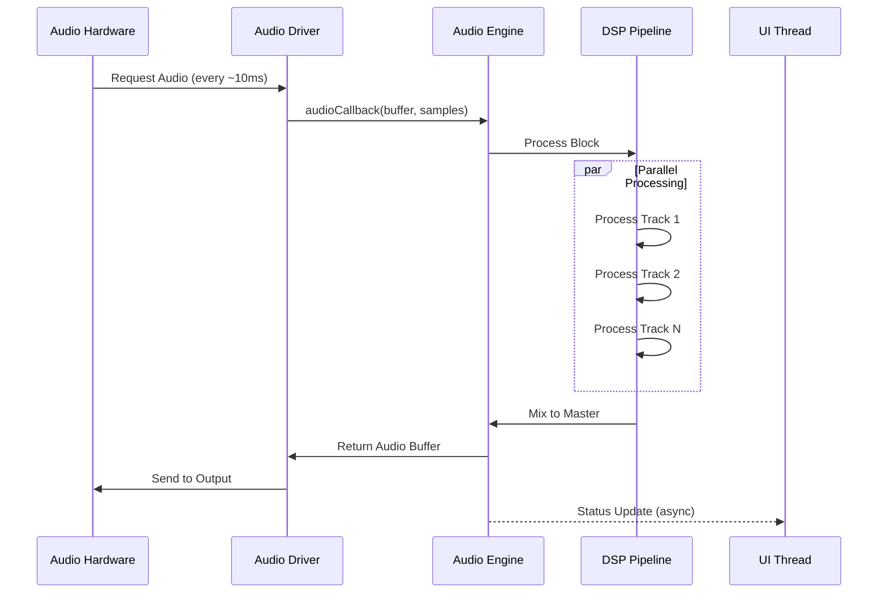
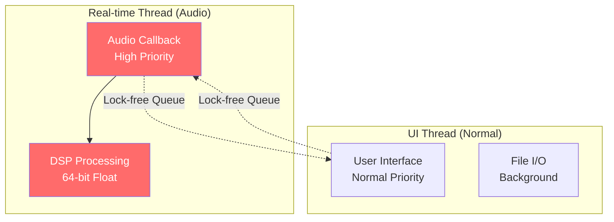

# NomadAudio Architecture

NomadAudio is NOMAD's professional audio engine, delivering ultra-low latency and high-quality sound.

## 📋 Overview

**Purpose:** Professional audio processing with real-time performance

**Status:** ✅ Complete

**Dependencies:** NomadCore, NomadPlat

**Location:** `/NomadAudio/`

## 🎯 Design Goals

- **Ultra-Low Latency** — <10ms round-trip latency
- **Real-time Safe** — No allocations or locks on audio thread
- **High Quality** — 64-bit float processing pipeline
- **Multi-threaded** — Parallel DSP processing
- **Cross-platform** — WASAPI, ALSA, CoreAudio support

## 🧩 Key Components

### Audio Engine

Core audio processing system.

**Features:**
- Sample-accurate timing
- 64-bit float pipeline
- Multi-channel support (up to 32 channels)
- Buffer management
- Thread-safe state management

**Example:**
```cpp
#include "NomadAudio/AudioEngine.h"

nomad::AudioEngine engine;

nomad::AudioConfig config;
config.sampleRate = 48000;
config.bufferSize = 512;  // ~10ms at 48kHz
config.channels = 2;

if (engine.initialize(config)) {
    engine.start();
    // Audio is now running
}
```

### WASAPI Driver (Windows)

Windows Audio Session API integration.

**Features:**
- Exclusive mode (lowest latency)
- Shared mode (compatibility)
- Automatic device detection
- Sample rate conversion
- Multi-tier processing

**Modes:**
```cpp
// Exclusive mode (lowest latency)
config.exclusive = true;
config.bufferSize = 128;  // 2.7ms at 48kHz

// Shared mode (better compatibility)
config.exclusive = false;
config.bufferSize = 512;  // 10.7ms at 48kHz
```

### RtAudio Backend

Cross-platform audio I/O abstraction.

**Supported APIs:**
- **Windows:** WASAPI, DirectSound, ASIO
- **Linux:** ALSA, PulseAudio, JACK
- **macOS:** CoreAudio

**Example:**
```cpp
#include "NomadAudio/RtAudio.h"

RtAudio audio;
RtAudio::StreamParameters params;
params.deviceId = audio.getDefaultOutputDevice();
params.nChannels = 2;

audio.openStream(&params, nullptr, RTAUDIO_FLOAT64,
                 48000, &bufferSize, audioCallback);
```

### DSP Pipeline

Digital signal processing chain.

**Features:**
- 64-bit precision
- SIMD optimization
- Multi-threaded processing
- Zero-latency monitoring
- Plugin slots (VST3 planned)

**Processing Flow:**
```
Input → Gain → EQ → Compressor → Effects → Output
```

### Buffer Management

Lock-free audio buffer system.

**Features:**
- Ring buffer for audio data
- Lock-free SPSC queue
- Zero-copy where possible
- Overflow/underrun detection

**Example:**
```cpp
nomad::AudioBuffer buffer(samples, channels);

// Write to buffer (UI thread)
buffer.write(audioData, samples);

// Read from buffer (audio thread)
buffer.read(outputBuffer, samples);
```

## 🏗️ Architecture

### Audio Processing Pipeline



### Thread Architecture



### Directory Structure

```
NomadAudio/
├── include/
│   └── NomadAudio/
│       ├── AudioEngine.h    # Core engine
│       ├── AudioDevice.h    # Device management
│       ├── AudioBuffer.h    # Buffer management
│       ├── DSP/             # DSP processors
│       │   ├── Gain.h
│       │   ├── EQ.h
│       │   └── Compressor.h
│       └── RtAudio.h        # RtAudio integration
├── src/
│   ├── AudioEngine.cpp
│   ├── wasapi/             # WASAPI implementation
│   │   ├── WASAPIDevice.cpp
│   │   └── WASAPIDriver.cpp
│   ├── rtaudio/            # RtAudio backend
│   │   └── RtAudio.cpp
│   └── DSP/                # DSP implementations
│       ├── Gain.cpp
│       └── ...
└── CMakeLists.txt
```

## ⚡ Real-time Safety

### No Allocations

Audio thread avoids dynamic memory:

```cpp
// ❌ Bad: Allocates on audio thread
void audioCallback(float* buffer, int samples) {
    std::vector<float> temp(samples);  // Allocation!
    process(temp.data());
}

// ✅ Good: Pre-allocated buffer
class AudioProcessor {
    std::vector<float> tempBuffer;  // Pre-allocated
    
public:
    AudioProcessor() : tempBuffer(4096) {}
    
    void audioCallback(float* buffer, int samples) {
        process(tempBuffer.data());  // No allocation
    }
};
```

### Lock-free Communication

Use lock-free queues for thread communication:

```cpp
// UI → Audio communication
nomad::LockFreeQueue<AudioCommand> commandQueue;

// UI thread: send command
commandQueue.push(PlayCommand{});

// Audio thread: process commands
AudioCommand cmd;
while (commandQueue.pop(cmd)) {
    processCommand(cmd);
}
```

### No System Calls

Avoid blocking operations on audio thread:

```cpp
// ❌ Bad: File I/O on audio thread
void audioCallback(float* buffer, int samples) {
    loadSample("kick.wav");  // Blocking!
}

// ✅ Good: Pre-load on UI thread
void loadResources() {
    kickSample = loadSample("kick.wav");  // UI thread
}

void audioCallback(float* buffer, int samples) {
    playSample(kickSample);  // Just play
}
```

## 🎵 Audio Pipeline Details

### Sample Processing Flow

```
┌─────────────────────────────────────────────┐
│ 1. Input (Hardware)                         │
│    ↓                                        │
│ 2. Format Conversion (int → float64)       │
│    ↓                                        │
│ 3. Gain Stage                               │
│    ↓                                        │
│ 4. EQ (Parametric)                          │
│    ↓                                        │
│ 5. Dynamics (Compressor/Limiter)           │
│    ↓                                        │
│ 6. Effects (Reverb, Delay, etc.)           │
│    ↓                                        │
│ 7. Master Bus                               │
│    ↓                                        │
│ 8. Format Conversion (float64 → int)       │
│    ↓                                        │
│ 9. Output (Hardware)                        │
└─────────────────────────────────────────────┘
```

### Buffer Size vs. Latency

| Buffer Size | Sample Rate | Latency | Use Case |
|-------------|-------------|---------|----------|
| 64 samples | 48 kHz | 1.3 ms | Live monitoring |
| 128 samples | 48 kHz | 2.7 ms | Live performance |
| 256 samples | 48 kHz | 5.3 ms | Recording |
| 512 samples | 48 kHz | 10.7 ms | Mixing (balanced) |
| 1024 samples | 48 kHz | 21.3 ms | Mixing (CPU-heavy) |

## 📊 Performance Characteristics

### CPU Usage

| Scenario | CPU Usage (1 core) | Notes |
|----------|-------------------|-------|
| Idle (no playback) | <1% | Minimal overhead |
| 1 track playback | 5-10% | Basic processing |
| 8 tracks + effects | 20-30% | Typical project |
| 32 tracks + plugins | 40-60% | Heavy project |

### Latency Measurements

**Round-trip latency (48 kHz):**
- **WASAPI Exclusive:** 8-12 ms
- **WASAPI Shared:** 15-25 ms
- **ASIO:** 5-10 ms
- **ALSA:** 10-20 ms

### Memory Usage

- **Engine overhead:** ~10 MB
- **Per track:** ~1-2 MB
- **Audio buffers:** ~5 MB (512 samples, 32 channels)

## 🎚️ Multi-Channel Support

### Channel Configuration

```cpp
// Stereo (2 channels)
config.channels = 2;

// 5.1 Surround (6 channels)
config.channels = 6;

// 7.1 Surround (8 channels)
config.channels = 8;

// Custom (up to 32 channels)
config.channels = 16;
```

### Channel Mapping

```
Stereo:        [L, R]
5.1 Surround:  [FL, FR, C, LFE, BL, BR]
7.1 Surround:  [FL, FR, C, LFE, BL, BR, SL, SR]
```

## 🧪 Usage Examples

### Complete Audio Application

```cpp
#include "NomadAudio/AudioEngine.h"

class MyDAW {
    nomad::AudioEngine engine;
    std::vector<float> samples;
    size_t playPosition = 0;
    
public:
    void initialize() {
        // Configure audio
        nomad::AudioConfig config;
        config.sampleRate = 48000;
        config.bufferSize = 512;
        config.channels = 2;
        
        // Set audio callback
        engine.setCallback([this](float* buffer, int samples) {
            processAudio(buffer, samples);
        });
        
        // Start audio
        if (!engine.initialize(config)) {
            NOMAD_LOG_ERROR("Failed to initialize audio");
            return;
        }
        
        engine.start();
    }
    
    void processAudio(float* buffer, int samples) {
        // Fill buffer with audio data
        for (int i = 0; i < samples * 2; i += 2) {
            if (playPosition < samples.size()) {
                float sample = samples[playPosition++];
                buffer[i] = sample;      // Left
                buffer[i + 1] = sample;  // Right
            } else {
                buffer[i] = 0.0f;
                buffer[i + 1] = 0.0f;
            }
        }
    }
};
```

### WASAPI Exclusive Mode

```cpp
// Request exclusive mode for lowest latency
nomad::AudioConfig config;
config.sampleRate = 48000;
config.bufferSize = 128;  // 2.7ms
config.exclusive = true;

if (engine.initialize(config)) {
    NOMAD_LOG_INFO("Exclusive mode: {}ms latency",
                   (config.bufferSize * 1000.0) / config.sampleRate);
}
```

## 🔧 Debugging Audio Issues

### Enable Audio Logging

```cpp
NOMAD_LOG_SET_LEVEL(LogLevel::Debug);
engine.enableDebugLogging(true);
```

### Monitor Performance

```cpp
auto stats = engine.getStats();
NOMAD_LOG_INFO("CPU: {:.1f}%, Latency: {:.1f}ms",
               stats.cpuUsage * 100.0,
               stats.latencyMs);

if (stats.underruns > 0) {
    NOMAD_LOG_WARNING("Audio underruns detected: {}", stats.underruns);
}
```

### Diagnose Dropouts

Common causes:
1. **Buffer too small** → Increase buffer size
2. **High CPU usage** → Optimize DSP code
3. **OS interrupts** → Disable power saving
4. **Disk I/O** → Pre-load samples

## 📚 Further Reading

- [Audio Pipeline →](overview.md#audio-processing-pipeline)
- [Threading Model →](overview.md#threading-model)
- [Performance Tuning →](../developer/performance-tuning.md)
- [Module Hierarchy →](modules.md)

---

**Next:** [Module Hierarchy →](modules.md)
