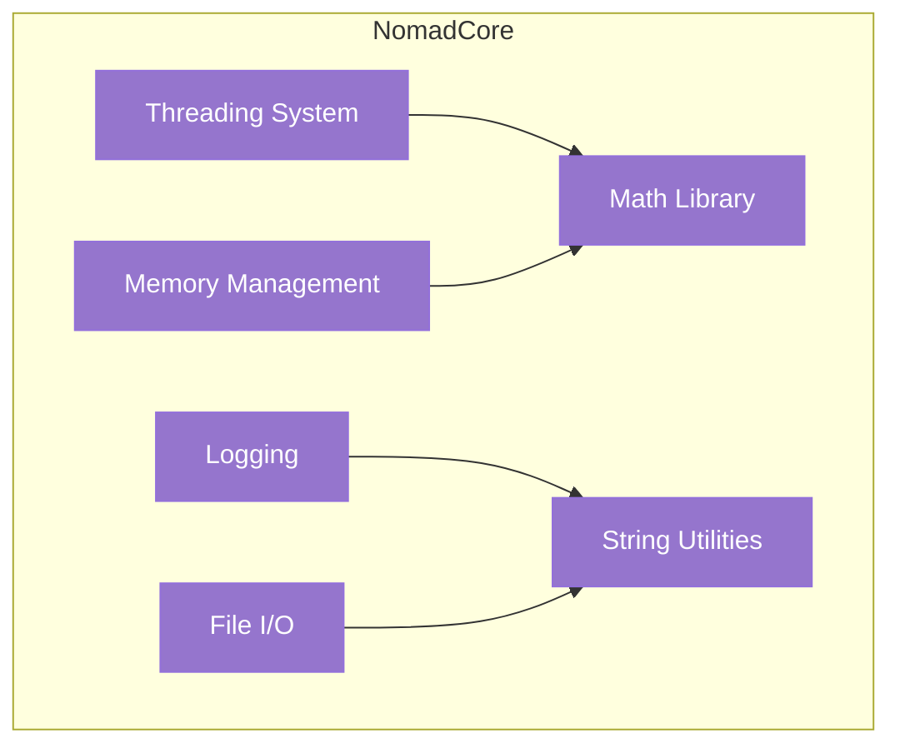

# NomadCore Architecture

NomadCore is the foundation layer of NOMAD DAW, providing fundamental utilities and data structures.

## 📋 Overview

**Purpose:** Zero-dependency foundation library for all NOMAD modules

**Status:** ✅ Complete

**Dependencies:** None

**Location:** `/NomadCore/`

## 🎯 Design Goals

- **Zero Dependencies** — No external libraries required
- **Header-Only** — Easy integration and fast compilation
- **Cross-Platform** — Works on Windows, Linux, macOS
- **High Performance** — Optimized for real-time audio applications
- **Thread-Safe** — Lock-free data structures for audio thread

## 🧩 Components

### Math Library

Provides mathematical operations for audio and graphics processing.

**Key Features:**
- Vector and matrix operations (Vec2, Vec3, Vec4, Mat4)
- Interpolation functions (linear, cubic, spline)
- Trigonometric functions (optimized for audio)
- DSP utilities (windowing, FFT helpers)

**Example:**
```cpp
#include "NomadCore/Math/Vector.h"

nomad::Vec2 pos(100.0f, 200.0f);
nomad::Vec2 vel(10.0f, -5.0f);
pos = pos + vel * deltaTime;
```

### Threading System

Lock-free data structures and threading primitives for real-time audio.

**Key Features:**
- **Lock-free Ring Buffer** — SPSC queue for audio thread
- **Thread Pool** — Worker threads for background tasks
- **Atomic Operations** — Wait-free synchronization
- **Thread-local Storage** — Per-thread data

**Example:**
```cpp
#include "NomadCore/Threading/LockFreeQueue.h"

nomad::LockFreeQueue<AudioEvent> queue(1024);

// Producer (UI thread)
queue.push(event);

// Consumer (Audio thread)
AudioEvent event;
if (queue.pop(event)) {
    // Process event
}
```

### File I/O System

Cross-platform file operations with UTF-8 support.

**Key Features:**
- Path manipulation (join, normalize, relative)
- File reading/writing (text, binary)
- Directory operations (list, create, remove)
- UTF-8 encoding/decoding

**Example:**
```cpp
#include "NomadCore/IO/File.h"

std::string content = nomad::File::readText("project.nomad");
nomad::File::writeText("backup.nomad", content);
```

### Logging System

Structured logging with multiple severity levels and outputs.

**Key Features:**
- Log levels (Trace, Debug, Info, Warning, Error, Fatal)
- Multiple outputs (console, file, debugger)
- Formatted messages with timestamps
- Thread-safe logging

**Example:**
```cpp
#include "NomadCore/Logging/Logger.h"

NOMAD_LOG_INFO("Loading project: {}", projectPath);
NOMAD_LOG_WARNING("Buffer underrun detected");
NOMAD_LOG_ERROR("Failed to open audio device: {}", errorCode);
```

### Memory Management

Custom allocators and memory utilities for performance-critical code.

**Key Features:**
- Arena allocator (fast bulk allocation/deallocation)
- Pool allocator (fixed-size object pools)
- Stack allocator (LIFO scratch memory)
- Memory tracking (debug builds only)

**Example:**
```cpp
#include "NomadCore/Memory/Arena.h"

nomad::Arena arena(1024 * 1024);  // 1 MB
void* ptr = arena.allocate(256);
// Use memory...
arena.reset();  // Free all at once
```

### String Utilities

UTF-8 string handling and formatting.

**Key Features:**
- UTF-8 encode/decode
- String formatting (printf-style)
- Case conversion (upper, lower)
- Trimming and splitting

**Example:**
```cpp
#include "NomadCore/String/Format.h"

std::string msg = nomad::format("Latency: {:.1f}ms", latency);
```

## 🏗️ Architecture

### Component Diagram



### Directory Structure

```
NomadCore/
├── include/
│   └── NomadCore/
│       ├── Math/
│       │   ├── Vector.h
│       │   ├── Matrix.h
│       │   └── Interpolation.h
│       ├── Threading/
│       │   ├── LockFreeQueue.h
│       │   ├── ThreadPool.h
│       │   └── Atomic.h
│       ├── IO/
│       │   ├── File.h
│       │   ├── Path.h
│       │   └── Stream.h
│       ├── Logging/
│       │   ├── Logger.h
│       │   └── LogSink.h
│       ├── Memory/
│       │   ├── Arena.h
│       │   ├── Pool.h
│       │   └── Stack.h
│       └── String/
│           ├── Format.h
│           └── UTF8.h
├── src/
│   └── (Implementation files)
└── CMakeLists.txt
```

## 🎯 Performance Characteristics

### Lock-Free Queue

- **Push:** O(1) wait-free
- **Pop:** O(1) wait-free
- **Memory:** Fixed size ring buffer
- **Contention:** None (SPSC)

### Arena Allocator

- **Allocate:** O(1) pointer bump
- **Deallocate:** O(1) (or N/A)
- **Reset:** O(1) reset pointer
- **Overhead:** Minimal (single pointer)

### File I/O

- **Read:** O(n) file size
- **Write:** O(n) data size
- **Buffered:** Yes (4 KB default)
- **Async:** Via thread pool

## 🔧 Usage Examples

### Complete Example: Audio Processing

```cpp
#include "NomadCore/Threading/LockFreeQueue.h"
#include "NomadCore/Math/Interpolation.h"
#include "NomadCore/Logging/Logger.h"

// Audio event structure
struct AudioEvent {
    float value;
    int64_t timestamp;
};

// Lock-free queue for UI → Audio communication
nomad::LockFreeQueue<AudioEvent> eventQueue(256);

// UI thread: send event
void onParameterChange(float newValue) {
    AudioEvent event;
    event.value = newValue;
    event.timestamp = getCurrentTime();
    
    if (!eventQueue.push(event)) {
        NOMAD_LOG_WARNING("Event queue full!");
    }
}

// Audio thread: process events
void audioCallback(float* buffer, int samples) {
    AudioEvent event;
    while (eventQueue.pop(event)) {
        // Smooth parameter change
        float smoothed = nomad::lerp(currentValue, event.value, 0.1f);
        currentValue = smoothed;
    }
    
    // Process audio with current parameters
    for (int i = 0; i < samples; ++i) {
        buffer[i] = processSample(buffer[i], currentValue);
    }
}
```

## 🧪 Testing

NomadCore includes comprehensive unit tests:

```bash
# Build and run tests
cmake -S . -B build -DNOMAD_BUILD_TESTS=ON
cmake --build build
ctest --test-dir build --output-on-failure
```

Test coverage:
- ✅ Math operations (100+ test cases)
- ✅ Lock-free queue (thread safety tests)
- ✅ File I/O (cross-platform tests)
- ✅ String utilities (UTF-8 tests)

## 🎨 API Design Philosophy

### 1. Header-Only by Default

Most components are header-only for easy integration:

```cpp
// No linking required
#include "NomadCore/Math/Vector.h"
```

### 2. Const-Correctness

All APIs respect const-correctness:

```cpp
float length(const Vec2& v);  // Doesn't modify v
void normalize(Vec2& v);      // Modifies v
```

### 3. No Exceptions

Real-time safe — no exceptions in audio code:

```cpp
bool result = queue.push(data);  // Returns success/failure
```

### 4. Modern C++17

Uses C++17 features for clean code:

```cpp
// std::optional for return values
std::optional<std::string> readFile(const std::string& path);
```

## 🔍 Internal Implementation

### Lock-Free Queue Algorithm

Uses a single-producer, single-consumer (SPSC) ring buffer:

```cpp
template<typename T>
class LockFreeQueue {
    std::vector<T> buffer;
    std::atomic<size_t> writeIndex;
    std::atomic<size_t> readIndex;
    
public:
    bool push(const T& item) {
        size_t write = writeIndex.load(std::memory_order_relaxed);
        size_t next = (write + 1) % buffer.size();
        
        if (next == readIndex.load(std::memory_order_acquire))
            return false;  // Queue full
            
        buffer[write] = item;
        writeIndex.store(next, std::memory_order_release);
        return true;
    }
    
    bool pop(T& item) {
        size_t read = readIndex.load(std::memory_order_relaxed);
        
        if (read == writeIndex.load(std::memory_order_acquire))
            return false;  // Queue empty
            
        item = buffer[read];
        readIndex.store((read + 1) % buffer.size(), std::memory_order_release);
        return true;
    }
};
```

## 📚 Further Reading

- [Threading Model →](overview.md#threading-model)
- [Module Hierarchy →](modules.md)
- [Performance Tuning →](../developer/performance-tuning.md)

---

**Next:** [NomadPlat Architecture →](nomad-plat.md)
