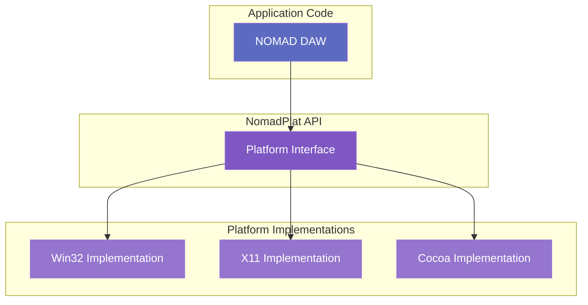

# NomadPlat Architecture

NomadPlat provides platform abstraction for NOMAD DAW, enabling cross-platform support.

## 📋 Overview

**Purpose:** Unified API for platform-specific operations

**Status:** ✅ Complete (Windows), 🚧 In Progress (Linux), 📅 Planned (macOS)

**Dependencies:** NomadCore

**Location:** `/NomadPlat/`

## 🎯 Supported Platforms

| Platform | Status | API | Notes |
|----------|--------|-----|-------|
| Windows 10/11 | ✅ Complete | Win32 | Primary target platform |
| Linux | 🚧 In Progress | X11, Wayland planned | Active development |
| macOS | 📅 Planned Q2 2025 | Cocoa | Future support |

## 🧩 Components

### Window Management

Create and manage application windows with event handling.

**Features:**
- Window creation and destruction
- Resize, minimize, maximize, fullscreen
- Event loop and message dispatching
- DPI awareness and scaling

**Example:**
```cpp
#include "NomadPlat/Window.h"

nomad::WindowConfig config;
config.title = "NOMAD DAW";
config.width = 1920;
config.height = 1080;

auto window = nomad::Window::create(config);
window->show();

while (window->isOpen()) {
    window->pollEvents();
    // Render frame
}
```

### Input System

Unified keyboard and mouse input handling.

**Features:**
- Keyboard events (key down/up, repeat)
- Mouse events (move, button, scroll)
- Input state queries
- Text input for UI

**Example:**
```cpp
window->setKeyCallback([](KeyEvent event) {
    if (event.key == Key::Space && event.action == Action::Press) {
        togglePlayback();
    }
});

window->setMouseCallback([](MouseEvent event) {
    if (event.button == MouseButton::Left) {
        handleClick(event.x, event.y);
    }
});
```

### File Dialogs

Native file open/save dialogs.

**Features:**
- Open file dialog (single/multiple)
- Save file dialog
- File filters (extensions)
- Remember last directory

**Example:**
```cpp
#include "NomadPlat/FileDialog.h"

auto path = nomad::FileDialog::open({
    .title = "Open Project",
    .filters = {{"NOMAD Project", "*.nomad"}},
    .multiSelect = false
});

if (path) {
    loadProject(*path);
}
```

### System Information

Query system capabilities and resources.

**Features:**
- CPU information (cores, features)
- Memory statistics (total, available)
- OS version and name
- Display information (monitors, DPI)

**Example:**
```cpp
#include "NomadPlat/SystemInfo.h"

auto info = nomad::SystemInfo::get();
NOMAD_LOG_INFO("CPU: {} cores, {} threads", 
               info.cpuCores, info.cpuThreads);
NOMAD_LOG_INFO("RAM: {} MB total, {} MB available",
               info.totalMemoryMB, info.availableMemoryMB);
```

### High-Resolution Timers

Precise timing for audio and animation.

**Features:**
- Microsecond precision
- Monotonic clock (doesn't jump)
- Sleep with high precision
- Frame timing utilities

**Example:**
```cpp
#include "NomadPlat/Timer.h"

auto start = nomad::Timer::now();
processAudio();
auto elapsed = nomad::Timer::elapsed(start);

NOMAD_LOG_DEBUG("Audio processing took {:.2f}ms", elapsed * 1000.0);
```

## 🏗️ Architecture

### Platform Abstraction Pattern



### Directory Structure

```
NomadPlat/
├── include/
│   └── NomadPlat/
│       ├── Window.h        # Window management
│       ├── Input.h         # Input handling
│       ├── FileDialog.h    # File dialogs
│       ├── SystemInfo.h    # System queries
│       └── Timer.h         # High-res timing
├── src/
│   ├── win32/             # Windows implementation
│   │   ├── WindowWin32.cpp
│   │   ├── InputWin32.cpp
│   │   └── FileDialogWin32.cpp
│   ├── x11/               # Linux X11 implementation
│   │   ├── WindowX11.cpp
│   │   └── InputX11.cpp
│   └── cocoa/             # macOS Cocoa (planned)
│       └── WindowCocoa.mm
└── CMakeLists.txt
```

## 🪟 Windows (Win32) Implementation

### Window Creation

Uses Win32 API with modern features:

```cpp
WNDCLASSEX wc = {};
wc.lpfnWndProc = WindowProc;
wc.hInstance = GetModuleHandle(nullptr);
wc.lpszClassName = "NomadWindow";
RegisterClassEx(&wc);

HWND hwnd = CreateWindowEx(
    0,
    "NomadWindow",
    "NOMAD DAW",
    WS_OVERLAPPEDWINDOW,
    CW_USEDEFAULT, CW_USEDEFAULT,
    1920, 1080,
    nullptr, nullptr,
    GetModuleHandle(nullptr),
    nullptr
);
```

### DPI Awareness

Supports high-DPI displays:

```cpp
SetProcessDpiAwareness(PROCESS_PER_MONITOR_DPI_AWARE);
float dpiScale = GetDpiForWindow(hwnd) / 96.0f;
```

### Event Loop

Processes Windows messages:

```cpp
MSG msg;
while (GetMessage(&msg, nullptr, 0, 0)) {
    TranslateMessage(&msg);
    DispatchMessage(&msg);
}
```

## 🐧 Linux (X11) Implementation

### Window Creation

Uses X11 with modern extensions:

```cpp
Display* display = XOpenDisplay(nullptr);
Window root = DefaultRootWindow(display);

Window window = XCreateSimpleWindow(
    display, root,
    0, 0, 1920, 1080, 1,
    BlackPixel(display, 0),
    WhitePixel(display, 0)
);

XMapWindow(display, window);
```

### Event Loop

Processes X11 events:

```cpp
XEvent event;
while (XPending(display)) {
    XNextEvent(display, &event);
    // Handle event
}
```

## 🎯 Design Principles

### 1. Zero-Overhead Abstraction

Platform-specific code is compiled conditionally:

```cpp
#if defined(NOMAD_PLATFORM_WINDOWS)
    #include "win32/WindowWin32.h"
    using PlatformWindow = WindowWin32;
#elif defined(NOMAD_PLATFORM_LINUX)
    #include "x11/WindowX11.h"
    using PlatformWindow = WindowX11;
#endif
```

### 2. Event-Driven Design

All input is handled via callbacks:

```cpp
window->setEventCallback([](Event& event) {
    if (event.type == EventType::KeyPress) {
        // Handle key press
    }
});
```

### 3. Resource Management

RAII for automatic cleanup:

```cpp
class Window {
public:
    ~Window() {
        if (handle) {
            destroy();
        }
    }
};
```

## 📊 Performance Characteristics

### Event Processing

- **Windows:** ~0.1ms per frame (60 FPS)
- **Linux:** ~0.2ms per frame (60 FPS)
- **Overhead:** Minimal (<1% CPU)

### Window Operations

| Operation | Windows | Linux | Notes |
|-----------|---------|-------|-------|
| Create | ~5ms | ~10ms | One-time cost |
| Resize | <1ms | <1ms | Instant |
| Event Poll | <0.1ms | <0.2ms | Per frame |

## 🧪 Testing

NomadPlat includes platform-specific tests:

```bash
# Run platform tests
cmake --build build
ctest --test-dir build -R "NomadPlat.*"
```

Test areas:
- ✅ Window creation and destruction
- ✅ Input event handling
- ✅ File dialog operations
- ✅ System information queries
- ✅ Timer precision

## 📚 API Reference

### Window API

```cpp
class Window {
public:
    static std::unique_ptr<Window> create(const WindowConfig& config);
    
    void show();
    void hide();
    void close();
    
    void setTitle(const std::string& title);
    void setSize(int width, int height);
    void setFullscreen(bool fullscreen);
    
    bool isOpen() const;
    bool isMinimized() const;
    bool isMaximized() const;
    
    void pollEvents();
    
    void setKeyCallback(KeyCallback callback);
    void setMouseCallback(MouseCallback callback);
    void setResizeCallback(ResizeCallback callback);
};
```

### Input API

```cpp
enum class Key {
    A, B, C, /* ... */ Z,
    Num0, Num1, /* ... */ Num9,
    Space, Enter, Escape,
    Left, Right, Up, Down,
    // ...
};

enum class MouseButton {
    Left, Right, Middle,
    Button4, Button5
};

struct KeyEvent {
    Key key;
    Action action;  // Press, Release, Repeat
    Modifiers mods; // Ctrl, Shift, Alt
};

struct MouseEvent {
    MouseButton button;
    Action action;
    float x, y;
    Modifiers mods;
};
```

## 🔍 Future Enhancements

### Planned Features

- **Wayland Support** (Linux)
- **Multi-monitor Support** (improved)
- **Touch Input** (tablets, touchscreens)
- **Gamepad Input** (MIDI controllers)
- **Clipboard Operations** (copy/paste)
- **Drag and Drop** (file import)

### macOS Support (Q2 2025)

- Cocoa window management
- Metal rendering backend
- CoreAudio integration
- Native menu bar

---

**Next:** [NomadUI Architecture →](nomad-ui.md)
