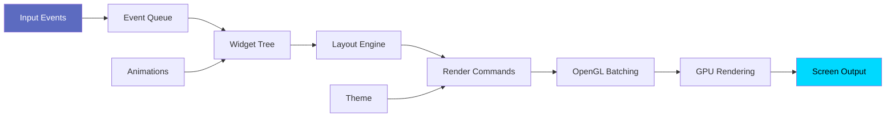
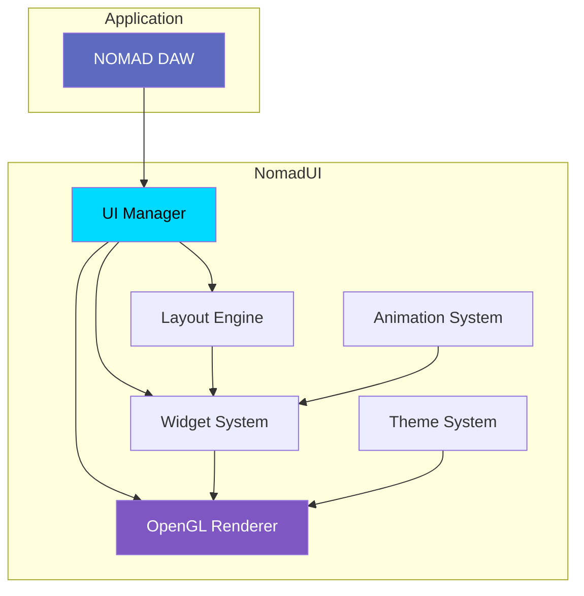
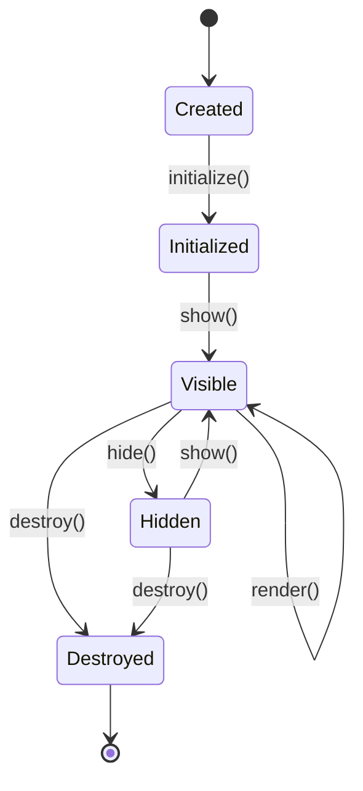

# NomadUI Architecture

NomadUI is NOMAD's custom GPU-accelerated UI framework, delivering buttery-smooth 60 FPS performance.

## 📋 Overview

**Purpose:** Custom OpenGL-based UI framework with professional features

**Status:** ✅ Complete

**Dependencies:** NomadCore, NomadPlat

**Location:** `/NomadUI/`

## 🎯 Design Goals

- **GPU-Accelerated** — Hardware rendering via OpenGL 3.3+
- **High Performance** — 60 FPS with adaptive frame rate
- **Modern UI** — Clean, professional design
- **Themeable** — Dark/light modes with custom colors
- **Responsive** — Smooth animations and transitions

## 🧩 Key Components

### OpenGL Renderer

Hardware-accelerated 2D rendering engine.

**Features:**
- OpenGL 3.3+ core profile
- MSAA anti-aliasing (2x, 4x, 8x)
- Vertex batching for efficiency
- Texture atlasing
- Shader-based rendering

**Example:**
```cpp
#include "NomadUI/Renderer.h"

nomad::Renderer renderer;
renderer.initialize(window->getContext());
renderer.setMSAA(4);  // 4x anti-aliasing

// Render frame
renderer.beginFrame();
renderer.drawRect(100, 100, 200, 50, theme.buttonColor);
renderer.drawText("Hello", 110, 115, theme.textColor);
renderer.endFrame();
```

### NanoVG Integration

Vector graphics library for smooth curves and gradients.

**Features:**
- Bezier curves and paths
- Gradients (linear, radial)
- Text rendering with fonts
- Drop shadows and glows
- Smooth anti-aliasing

### Widget System

Comprehensive library of UI widgets.

**Available Widgets:**
- **Button** — Click actions
- **Slider** — Value adjustment
- **TextBox** — Text input
- **Label** — Static text
- **Panel** — Container
- **ScrollView** — Scrollable content
- **Dropdown** — Selection menu
- **Checkbox** — Boolean toggle
- **RadioButton** — Single selection

**Example:**
```cpp
auto button = std::make_shared<Button>("Play");
button->setBounds(10, 10, 100, 40);
button->onClick([]() {
    startPlayback();
});
ui->addChild(button);
```

### Layout Engine

Flexbox-inspired automatic layout system.

**Features:**
- Horizontal/vertical flow
- Alignment and justification
- Spacing and padding
- Size constraints (min/max)
- Responsive layouts

**Example:**
```cpp
auto hbox = std::make_shared<HBox>();
hbox->setSpacing(10);
hbox->setPadding(20);
hbox->addChild(playButton);
hbox->addChild(stopButton);
hbox->addChild(recordButton);
```

### Theme System

Customizable color schemes and styling.

**Features:**
- Dark and light modes
- Custom color palettes
- Font customization
- Size and spacing presets
- Hot-reloadable themes

**Example:**
```cpp
Theme darkTheme;
darkTheme.backgroundColor = Color(0x1a, 0x1a, 0x2e);
darkTheme.primaryColor = Color(0x5c, 0x6b, 0xc0);
darkTheme.accentColor = Color(0x00, 0xd9, 0xff);
darkTheme.textColor = Color(0xff, 0xff, 0xff);

ui->setTheme(darkTheme);
```

### Animation System

Smooth transitions and animations.

**Features:**
- Easing functions (ease-in, ease-out, cubic)
- Property animations (position, color, opacity)
- Keyframe animations
- Animation chaining
- Spring physics

**Example:**
```cpp
auto anim = Animation::create()
    .duration(0.3f)
    .easing(Easing::EaseOutCubic)
    .property(&button->opacity, 0.0f, 1.0f);
    
anim->start();
```

## 🏗️ Architecture

### Rendering Pipeline



### Component Hierarchy



### Directory Structure

```
NomadUI/
├── include/
│   └── NomadUI/
│       ├── Renderer.h      # OpenGL renderer
│       ├── Widget.h        # Base widget class
│       ├── Widgets/        # Concrete widgets
│       │   ├── Button.h
│       │   ├── Slider.h
│       │   ├── TextBox.h
│       │   └── ...
│       ├── Layout.h        # Layout engine
│       ├── Theme.h         # Theme system
│       └── Animation.h     # Animation system
├── src/
│   ├── Renderer.cpp
│   ├── Widget.cpp
│   ├── Widgets/
│   │   ├── Button.cpp
│   │   └── ...
│   ├── Layout.cpp
│   └── nanovg/            # NanoVG integration
└── CMakeLists.txt
```

## 🎨 Rendering Details

### Vertex Batching

NomadUI batches draw calls for efficiency:

```cpp
// Instead of many small draws:
for (auto& rect : rects) {
    drawRect(rect);  // ❌ Many OpenGL calls
}

// Batch into single draw call:
batchRects(rects);
drawBatch();  // ✅ Single OpenGL call
```

### Texture Atlasing

Icons and UI elements are packed into a single texture:

```
┌─────────────────────┐
│ Icon1 │ Icon2 │Icon3│
├───────┼───────┼─────┤
│ Icon4 │ Icon5 │Icon6│
├───────┴───────┴─────┤
│    Font Atlas        │
└─────────────────────┘
```

Benefits:
- Fewer texture switches
- Better GPU cache usage
- Faster rendering

### MSAA Anti-Aliasing

Multi-sample anti-aliasing for smooth edges:

```cpp
// 4x MSAA = 4 samples per pixel
renderer.setMSAA(4);

// Result: Smooth curves and text
```

## 🚀 Performance Optimizations

### Adaptive Frame Rate

NomadUI adjusts frame rate based on activity:

| Activity | FPS | Use Case |
|----------|-----|----------|
| Idle | 24 | Minimal CPU/GPU usage |
| Animation | 60 | Smooth transitions |
| Mouse hover | 30 | Responsive but efficient |
| Playback | 60 | Smooth timeline updates |

### Dirty Rectangle Optimization

Only redraws changed regions:

```cpp
if (widget->isDirty()) {
    Rect dirtyRect = widget->getBounds();
    renderer.markDirty(dirtyRect);
}

// Only redraw dirty regions
renderer.drawDirtyRegions();
```

### Culling

Widgets outside the viewport are not rendered:

```cpp
if (!widget->getBounds().intersects(viewport)) {
    return;  // Skip rendering
}
```

## 📊 Performance Metrics

### Frame Time Budget (60 FPS)

| Phase | Budget | Actual |
|-------|--------|--------|
| Input Processing | 2ms | <1ms |
| Layout | 3ms | 1-2ms |
| Rendering | 10ms | 5-8ms |
| Total | 16.67ms | 8-12ms |

### Memory Usage

- **Renderer:** ~20 MB
- **Widget tree:** ~5-10 MB (100 widgets)
- **Texture atlas:** ~10 MB
- **Font cache:** ~5 MB

## 🎯 Widget Lifecycle



## 🧪 Usage Examples

### Complete UI Application

```cpp
#include "NomadUI/Renderer.h"
#include "NomadUI/Widgets/Button.h"
#include "NomadUI/Widgets/Slider.h"

// Initialize
nomad::Renderer renderer;
renderer.initialize(window->getContext());

Theme darkTheme = Theme::dark();
renderer.setTheme(darkTheme);

// Create UI
auto playButton = std::make_shared<Button>("Play");
playButton->setBounds(10, 10, 100, 40);
playButton->onClick([]() { startPlayback(); });

auto volumeSlider = std::make_shared<Slider>(0.0f, 1.0f);
volumeSlider->setBounds(120, 10, 200, 40);
volumeSlider->setValue(0.7f);
volumeSlider->onValueChange([](float val) {
    setVolume(val);
});

// Main loop
while (window->isOpen()) {
    window->pollEvents();
    
    // Update
    playButton->update(deltaTime);
    volumeSlider->update(deltaTime);
    
    // Render
    renderer.beginFrame();
    playButton->render(renderer);
    volumeSlider->render(renderer);
    renderer.endFrame();
    
    window->swapBuffers();
}
```

## 🔍 Advanced Features

### Custom Widgets

Create custom widgets by extending the base class:

```cpp
class Waveform : public Widget {
public:
    void render(Renderer& renderer) override {
        // Custom rendering logic
        for (int i = 0; i < samples.size() - 1; ++i) {
            float x1 = bounds.x + i * scale;
            float y1 = bounds.y + samples[i] * bounds.height;
            float x2 = bounds.x + (i + 1) * scale;
            float y2 = bounds.y + samples[i + 1] * bounds.height;
            
            renderer.drawLine(x1, y1, x2, y2, theme.waveformColor);
        }
    }
};
```

### Custom Themes

Load themes from JSON:

```json
{
  "name": "Nord Theme",
  "colors": {
    "background": "#2e3440",
    "primary": "#5e81ac",
    "accent": "#88c0d0",
    "text": "#eceff4"
  }
}
```

## 📚 Further Reading

- [Rendering Pipeline →](overview.md#ui-rendering-pipeline)
- [Performance Tuning →](../developer/performance-tuning.md)
- [Module Hierarchy →](modules.md)

---

**Next:** [NomadAudio Architecture →](nomad-audio.md)
