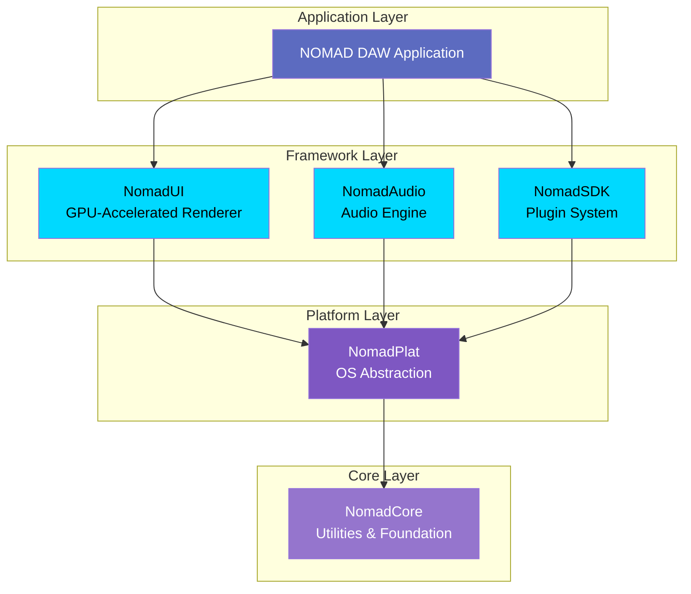
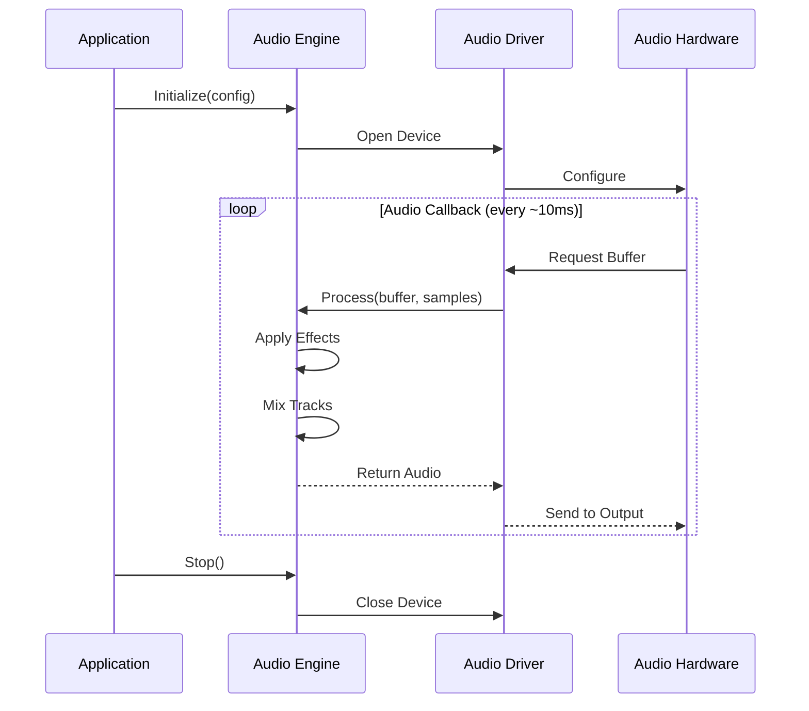
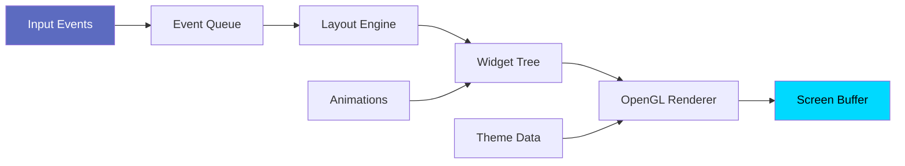
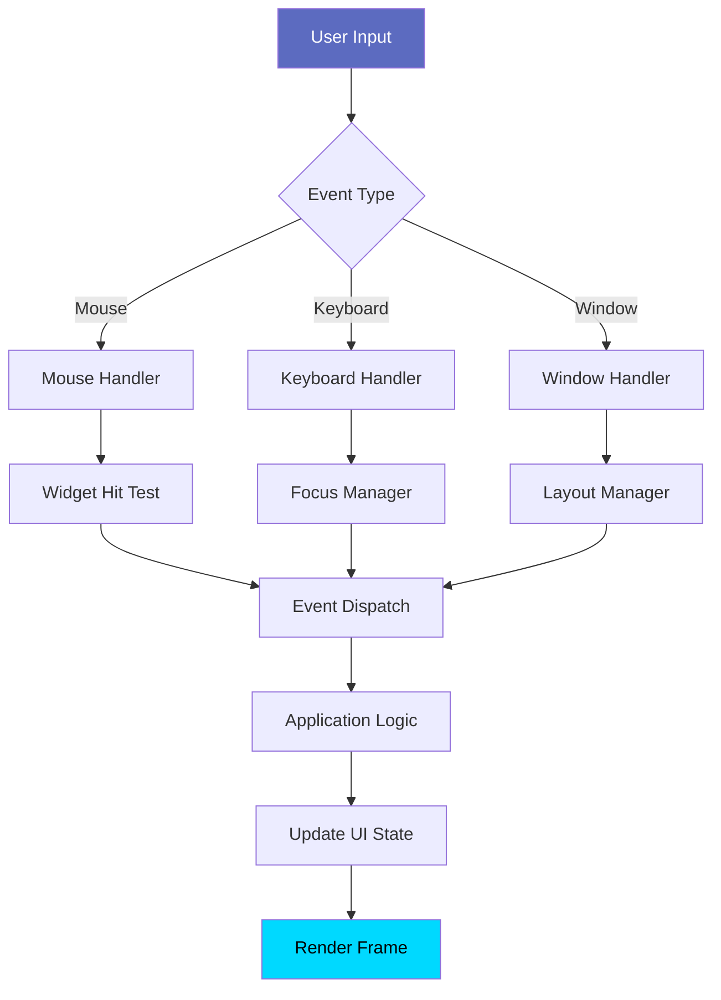
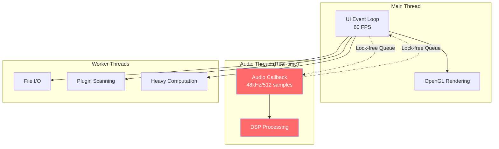

# NOMAD Architecture Overview

NOMAD DAW is built on a clean, modular architecture that separates concerns and promotes maintainability.

## 🏗️ High-Level Architecture

NOMAD follows a layered architecture pattern where each layer builds upon the previous one:



## 📦 Module Hierarchy

### Layer Dependencies

Each layer only depends on layers below it, never above:

```
┌─────────────────────────────────────┐
│     NOMAD DAW (Application)         │
├─────────────────────────────────────┤
│  NomadUI │ NomadAudio │ NomadSDK    │  ← Framework Layer
├─────────────────────────────────────┤
│          NomadPlat                   │  ← Platform Layer
├─────────────────────────────────────┤
│          NomadCore                   │  ← Core Layer
└─────────────────────────────────────┘
```

This strict hierarchy ensures:

- **Clean dependencies** — No circular dependencies
- **Platform portability** — Easy to add new platforms
- **Testability** — Each layer can be tested independently
- **Maintainability** — Changes in one layer don't break others

## 🧩 Core Modules

### NomadCore — Foundation

The lowest layer providing fundamental utilities:

- **Math Library** — Vector/matrix operations, interpolation
- **Threading** — Lock-free queues, thread pools
- **File I/O** — Cross-platform file operations
- **Logging** — Structured logging system
- **Memory Management** — Allocators and pools
- **String Utilities** — UTF-8 handling, formatting

**Key Features:**
- Zero dependencies on external libraries
- Header-only where possible for easy integration
- Platform-agnostic implementations

[Learn more about NomadCore →](nomad-core.md)

### NomadPlat — Platform Abstraction

Provides a unified API for platform-specific operations:

- **Window Management** — Create, resize, event handling
- **Input Handling** — Keyboard, mouse, touch
- **File Dialogs** — Open/save dialogs
- **System Info** — CPU, memory, OS details
- **High-Resolution Timers** — Precise timing for audio

**Supported Platforms:**
- ✅ Windows 10/11 (Win32)
- 🚧 Linux (X11, Wayland planned)
- 📅 macOS (Cocoa planned)

[Learn more about NomadPlat →](nomad-plat.md)

### NomadUI — GPU-Accelerated Renderer

Custom OpenGL-based UI framework:

- **OpenGL 3.3+ Renderer** — Hardware-accelerated graphics
- **NanoVG Integration** — Smooth vector graphics
- **Layout System** — Flexbox-inspired layout engine
- **Widget Library** — Buttons, sliders, text inputs
- **Theme System** — Dark/light modes, customizable colors
- **SVG Icon System** — Scalable vector icons
- **Animation System** — Smooth transitions

**Performance Features:**
- Adaptive FPS (24-60 FPS based on activity)
- MSAA anti-aliasing for smooth edges
- Texture atlasing for efficient rendering
- Dirty rectangle optimization

[Learn more about NomadUI →](nomad-ui.md)

### NomadAudio — Audio Engine

Professional audio processing system:

- **WASAPI Integration** (Windows) — Exclusive/shared mode
- **RtAudio Backend** — Cross-platform audio I/O
- **64-bit Audio Pipeline** — Professional quality processing
- **Multi-threaded DSP** — Parallel audio processing
- **Sample-accurate Timing** — Precise audio scheduling
- **Low-latency Design** — <10ms round-trip latency

**Audio Features:**
- Sample rate: 44.1kHz - 192kHz
- Buffer sizes: 64 - 4096 samples
- Bit depth: 16, 24, 32-bit integer and float
- Multi-channel support (up to 32 channels)

[Learn more about NomadAudio →](nomad-audio.md)

### NomadSDK — Plugin System (Planned)

Future plugin and extension system:

- **VST3 Hosting** — Load VST3 plugins
- **Effect Processing** — Insert and send effects
- **Automation** — Parameter automation system
- **MIDI Routing** — MIDI device management

**Status:** Planned for Q2 2025

## 🔄 Data Flow Architecture

### Audio Processing Pipeline



### UI Rendering Pipeline



### Event Flow



## 🧵 Threading Model

NOMAD uses a multi-threaded architecture for optimal performance:



### Thread Responsibilities

| Thread | Priority | Purpose | Typical Load |
|--------|----------|---------|--------------|
| **Main/UI Thread** | Normal | User input, rendering, layout | ~20-30% CPU |
| **Audio Thread** | Real-time | Audio callback, DSP processing | ~10-40% CPU |
| **File I/O Thread** | Low | Loading samples, saving projects | Variable |
| **Worker Threads** | Low-Normal | Plugin scanning, analysis | Variable |

### Thread Communication

NOMAD uses **lock-free data structures** for thread communication:

- **Lock-free Ring Buffer** — Audio ↔ UI communication
- **Message Queue** — UI ↔ Worker threads
- **Atomic Operations** — Shared state synchronization

This ensures:
- ✅ No priority inversion
- ✅ No blocking on real-time thread
- ✅ Predictable latency
- ✅ Crash safety

## 🗂️ Project Structure

```
NOMAD/
├── NomadCore/          # Core utilities (math, threading, I/O)
│   ├── include/        # Public headers
│   ├── src/            # Implementation
│   └── CMakeLists.txt
│
├── NomadPlat/          # Platform abstraction layer
│   ├── include/        # Platform APIs
│   ├── src/
│   │   ├── win32/      # Windows implementation
│   │   ├── x11/        # Linux X11 implementation
│   │   └── cocoa/      # macOS implementation (planned)
│   └── CMakeLists.txt
│
├── NomadUI/            # GPU-accelerated UI framework
│   ├── include/        # UI components
│   ├── src/            # Renderer, widgets, layout
│   └── CMakeLists.txt
│
├── NomadAudio/         # Audio engine
│   ├── include/        # Audio APIs
│   ├── src/
│   │   ├── wasapi/     # WASAPI implementation
│   │   ├── rtaudio/    # RtAudio backend
│   │   └── engine/     # Core audio engine
│   └── CMakeLists.txt
│
├── Source/             # Main DAW application
│   ├── Timeline/       # Sequencer and timeline
│   ├── Mixer/          # Mixing console
│   ├── UI/             # Application UI
│   └── main.cpp
│
└── docs/               # Documentation (you are here!)
```

## 🎯 Design Principles

NOMAD's architecture follows these key principles:

### 1. Separation of Concerns
Each module has a single, well-defined responsibility.

### 2. Dependency Inversion
High-level modules don't depend on low-level modules. Both depend on abstractions.

### 3. Open/Closed Principle
Modules are open for extension but closed for modification.

### 4. Real-time Safety
Audio code avoids allocations, locks, and system calls.

### 5. Zero-Copy Where Possible
Data is passed by reference or pointer to avoid copies.

### 6. Cache-Friendly Design
Data structures are designed for CPU cache efficiency.

## 📊 Performance Characteristics

### Audio Engine
- **Latency:** 10-20ms (512 samples @ 48kHz)
- **CPU Usage:** 10-40% (single core) during playback
- **Sample Rate:** Up to 192kHz supported
- **Channel Count:** Up to 32 channels

### UI Renderer
- **Frame Rate:** Adaptive 24-60 FPS
- **CPU Usage:** 5-15% (single core) when idle
- **GPU Usage:** Minimal (< 10% on integrated GPUs)
- **Memory:** ~50-100 MB for UI framework

### Memory Footprint
- **Base Application:** ~100 MB
- **Per Audio Track:** ~1-5 MB
- **Plugin Hosting:** Variable (depends on plugins)

## 🔍 Next Steps

Dive deeper into specific modules:

- [NomadCore Architecture →](nomad-core.md)
- [NomadPlat Architecture →](nomad-plat.md)
- [NomadUI Architecture →](nomad-ui.md)
- [NomadAudio Architecture →](nomad-audio.md)
- [Module Hierarchy →](modules.md)

Or explore other documentation:

- [Developer Guide →](../developer/contributing.md)
- [API Reference →](../api/index.md)
- [Performance Tuning →](../developer/performance-tuning.md)
